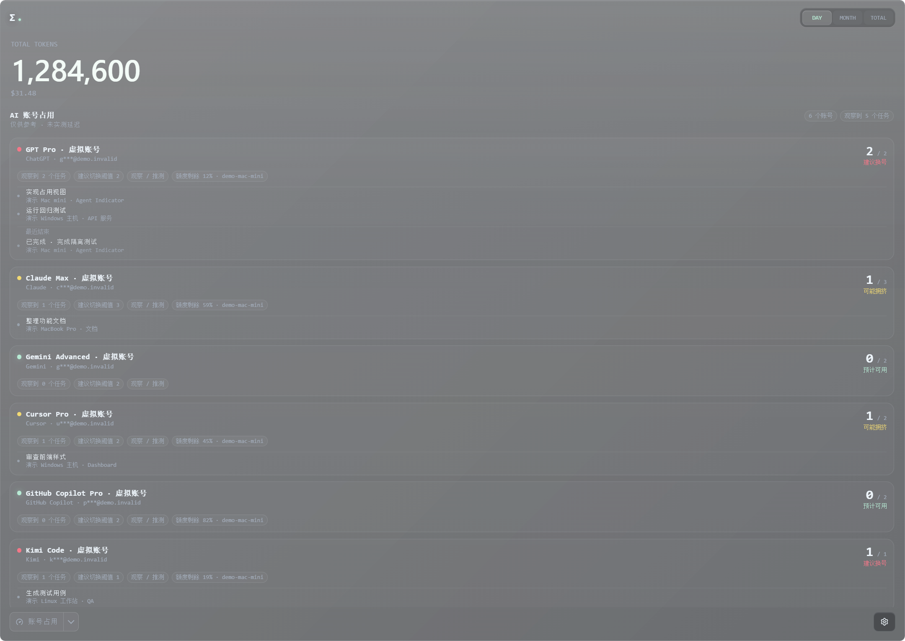
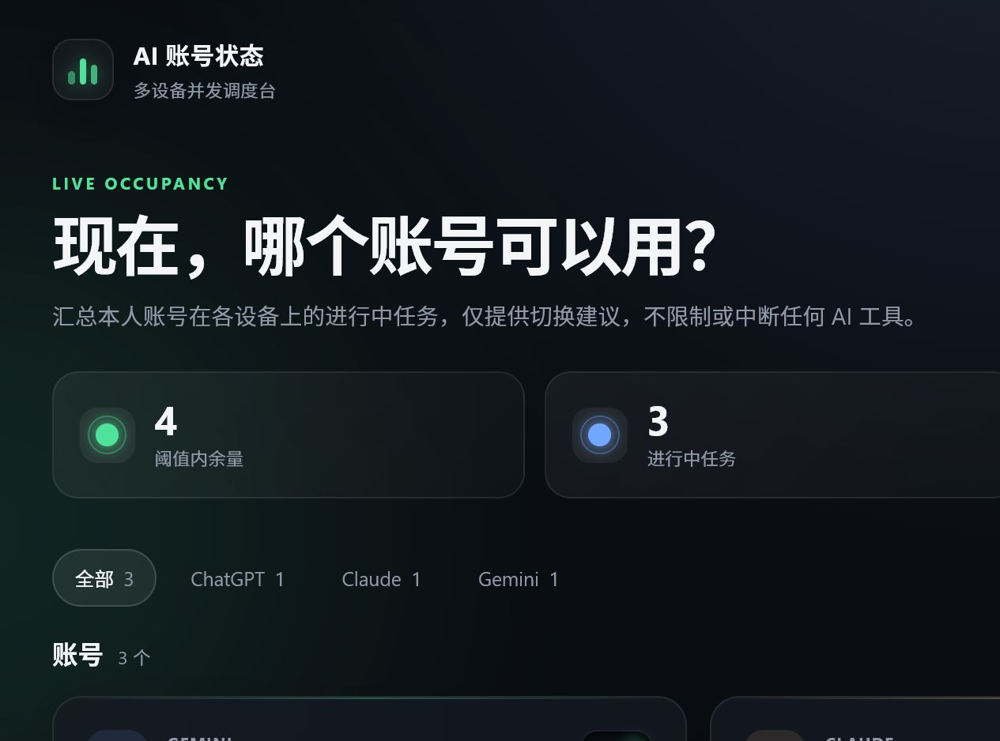

# Token Monitor account occupancy



The screenshot above is the feature running inside Token Monitor's normal Electron widget. All account names, masked identities, device names, tasks, usage, and quota values shown in it are synthetic demonstration data from an isolated local Hub.

The same Hub also exposes an optional browser management page:



## Product definition

This feature is a local-first, multi-device account operations view for people who use several AI providers and several accounts on each provider. Every participating Token Monitor device reports which AI agent task it is currently running and which configured account it is using. The existing Hub combines those reports with the freshest per-account quota snapshot available from participating devices.

The primary view should answer, without remotely controlling any AI tool:

- Which device is currently using which provider, product, and account?
- How many observed tasks are active on that account, and which devices started them?
- Has a task finished, reported an error, or merely stopped reporting and expired?
- What is the freshest known remaining quota for that exact account and quota pool?
- Is another account or provider likely to be a better manual choice on this device?

Example: if a Mac mini and a Windows workstation are both running tasks with the same GPT Pro account, a MacBook should show both tasks under one canonical account. It may suggest another account or provider when the user-defined occupancy threshold is reached, the account quota is low, or recent real requests show rate limiting or abnormal latency. It must not automatically switch accounts, stop work, submit probes, or claim an undocumented provider concurrency limit.

The canonical relationship is:

`device → AI surface/agent → canonical provider account → active/recent task → quota pool and passive health evidence`

Provider credentials, cookies, prompts, responses, source code, and raw conversation content are outside this feature's data model. Account correlation should use a provider-issued stable account key when Token Monitor already has one, otherwise a user-confirmed mapping. Raw account identifiers should not be invented from plan price or inferred from usage volume.

### Delivery status

The current patch implements the first usable layer: Hub account registry, multi-device task leases, task/device labels, a bounded recent completion/failure/expiry timeline, real-time SSE updates, advisory traffic lights, explicit links to Token Monitor's existing per-account quota snapshots, manual and CLI reporting, and an optional ChatGPT browser detector. Passive latency and request-level 429 health are not yet collected; quota and occupancy therefore remain separate evidence instead of being collapsed into a claim about actual responsiveness.

The occupancy signal answers a different question from token usage: **which of my own AI subscription accounts is currently least busy?** The Hub keeps an account registry and short-lived task leases, then derives an advisory traffic-light state for every account.

- **Green**: no observed active task; expected to be the best choice.
- **Yellow**: at least one observed active task; it may be busier.
- **Red**: observed tasks reached the user-configured advisory threshold; switching is suggested.
- **Gray**: the account is disabled for monitoring or there is not enough fresh data.

These lights are local recommendations, not provider-published concurrency limits or proof of actual latency. A red account can still be recorded and used: Token Monitor never blocks, stops, switches, retries, or submits work to an AI service.

The feature records account aliases, masked identity labels, device/project labels, and lease timestamps. It does not need provider passwords, cookies, OAuth tokens, API keys, prompts, source code, or chat content.

When Token Monitor runs as a Hub host or client, the main view switcher includes an **Occupancy / 账号占用** read-only view. It consumes the existing authenticated stats stream, so account changes and heartbeats appear without a separate polling channel. Local-only mode explains how to enable Host or connect to a Hub.

## Compliance boundary

Use this feature only for accounts you personally own or accounts formally assigned to you by an organization. Do not share personal login credentials, pool one personal subscription across people, resell access, or use account switching to evade provider rate limits or protective measures. Token Monitor is an observability tool for a human decision; it is not a limit-bypass tool. Managed accounts also remain subject to the organization's agreement and internal policy.

Provider terms and product limits change. The project therefore does not automatically log in, inspect private provider endpoints, infer a paid tier from credentials, or claim an undocumented official concurrency number. Configure the advisory threshold yourself and verify plan/usage information in each provider's official settings or documented API/CLI.

## Use the existing Token Monitor Hub

Account occupancy is part of the normal Token Monitor Hub; it is not a separate application or server. In the widget, choose **Host hub on this device** under **Settings → Multi-device Sync**, or run the existing headless Hub:

```powershell
npm run hub
```

The default Hub URL is `http://127.0.0.1:17321`. Its authenticated `/api/stats` response and SSE stream include the occupancy snapshot alongside the existing usage data. The optional browser dashboard is available at `/occupancy` on that same Hub.

Always configure `TOKEN_MONITOR_SECRET` before connecting from a browser extension or another origin. For a non-loopback address, plain HTTP exposes the bearer secret and task metadata to the network; use HTTPS or a trusted encrypted VPN such as Tailscale.

The current prototype supports the in-widget Hub and the Node Hub. The Cloudflare Worker backend does not yet persist occupancy leases; adding equivalent Worker storage and expiry behavior is intentionally left for a follow-up change.

## Configure the Hub connection

The CLI uses the same Hub URL and shared secret as the widget and headless agent. Put them in `.env` at the project root or provide command-line flags:

```dotenv
TOKEN_MONITOR_HUB_URL=http://192.168.1.10:17321
TOKEN_MONITOR_SECRET=replace-with-a-random-shared-secret
TOKEN_MONITOR_DEVICE_ID=desktop-a

TOKEN_MONITOR_OCCUPANCY_HEARTBEAT_MS=15000
TOKEN_MONITOR_OCCUPANCY_TTL_MS=45000
```

The heartbeat interval must be shorter than the TTL. If the CLI, machine, or network fails, the Hub automatically expires the lease after its TTL instead of leaving the account permanently occupied.

All commands also accept `--hub-url`, `--secret`, `--device-id`, and `--json`. Command-line values take precedence over environment values.

Run the CLI from the checkout with `npm run occupancy -- <arguments>`. After installing or linking the package, use the `token-monitor-occupancy` executable directly:

```powershell
npm link
token-monitor-occupancy status
```

## Manage accounts

Create an entry for each subscription account. The alias should be recognizable on every device; the identity should already be masked. `--advisory-threshold` is a user preference, not a provider limit. The legacy `--max-concurrency` spelling remains supported and is never enforced.

```powershell
token-monitor-occupancy account add --provider claude --alias "Claude Main" --advisory-threshold 2 --identity "m***@example.com"
token-monitor-occupancy account add --provider chatgpt --alias "Codex Work" --advisory-threshold 1
token-monitor-occupancy account list
```

Quota linking is explicit so Token Monitor never guesses that two differently named products share an account. Use the authenticated Hub dashboard to select a detected quota account, or bind the provider account key from authenticated JSON output:

```powershell
token-monitor-occupancy account update "Codex Work" --quota-provider codex --quota-account-key "sha256:..."
token-monitor-occupancy account update "Codex Work" --clear-quota-link
```

`--quota-account-email` is also accepted for setup. The Hub immediately converts the normalized email to a provider-scoped, stable matching hash and never writes the raw email into `occupancy.json`. This hash is a linkable identifier, not anonymization; existing authenticated AI Tool Limits snapshots may still contain the provider-supplied email as documented in `docs/API.md`. Plan labels are display metadata only and are never used alone to match accounts.

An account can be referenced by its exact ID or by a case-insensitive unique alias:

```powershell
token-monitor-occupancy account update "Claude Main" --advisory-threshold 3
token-monitor-occupancy account update "Codex Work" --disabled
token-monitor-occupancy account update "Codex Work" --enabled true
token-monitor-occupancy account remove "Codex Work"
```

Aliases must be unambiguous. If two accounts have the same alias, use the account ID shown by `account list --json`.

## Inspect traffic-light status

```powershell
token-monitor-occupancy status
token-monitor-occupancy --json status
```

The text view is intended for quick terminal checks:

```text
[YELLOW] Claude Main (claude) 1/2 m***@example.com
[RED] Codex Work (chatgpt) 1/1
[GREEN] Claude Backup (claude) 0/1
```

Use `--json` for scripts and integrations. JSON fields follow the Hub occupancy snapshot rather than the human-oriented text format.

## Wrap an AI CLI command

`run` is the safest way to track CLI work. It obtains a lease before starting the child command, sends periodic heartbeats, and releases the lease when the child exits. Arguments after `--` are passed directly to the executable without a shell:

```powershell
token-monitor-occupancy run --account "Claude Main" --project "Storefront" --task "Checkout refactor" -- claude
token-monitor-occupancy run --account "Codex Work" --project "API" -- codex exec "review the current changes"
```

The child process's exit code is preserved. `SIGINT`, `SIGTERM`, and `SIGHUP` are forwarded to the child, and the lease is released once even when a signal interrupts the wrapper. A red account is still recorded and the child still starts. The light is advisory only.

Do not put secrets in `--task` or `--project`; these labels are synchronized to the Hub and visible to authenticated clients.

## Manual leases

For a process that cannot be wrapped, create and maintain a lease explicitly:

```powershell
token-monitor-occupancy start --account "Claude Main" --project "Storefront" --task "Browser session" --json
token-monitor-occupancy heartbeat <lease-id> --fence-token <fence-token>
token-monitor-occupancy stop <lease-id> --fence-token <fence-token>
```

Save both the lease ID (`lease.id` in the JSON response) and `lease.fenceToken` returned by `start`. A fence token prevents an old client from renewing or releasing a replacement lease that reused the same logical task. Call `heartbeat` before the TTL expires. Both `heartbeat` and `stop` require the fence token. Manual leases also expire automatically when heartbeats stop.

## HTTP API

The CLI uses these authenticated Hub endpoints:

| Method | Endpoint | Purpose |
| --- | --- | --- |
| `GET` | `/api/occupancy/snapshot` | Current accounts, leases, recent task outcomes, quota links, counts, and lights |
| `GET` / `POST` | `/api/occupancy/accounts` | List or create accounts |
| `PUT` / `DELETE` | `/api/occupancy/accounts/:id` | Update or remove one account |
| `POST` | `/api/occupancy/leases` | Record an observed task (never blocked by the advisory threshold) |
| `POST` | `/api/occupancy/leases/:id/heartbeat` | Renew a lease using its fence token |
| `DELETE` | `/api/occupancy/leases/:id` | Release a lease |
| `GET` | `/api/occupancy/events` | Server-sent occupancy updates for dashboards |

Send the shared secret as `Authorization: Bearer <TOKEN_MONITOR_SECRET>`. A Hub without a secret is restricted to loopback by the existing Hub safety policy.

## Operational notes

- Run one Hub reachable by all participating devices. Every CLI and widget must use the same URL and secret.
- Use a stable, unique `TOKEN_MONITOR_DEVICE_ID` per machine.
- Keep aliases descriptive but non-sensitive, such as `Claude Main` or `Codex Work`.
- A normal `run` does not need manual heartbeat or stop commands.
- A network outage may make the dashboard temporarily stale; the Hub removes the task record after TTL if no heartbeat arrives.
- Account removal should only be done after its live leases have been stopped or expired.
