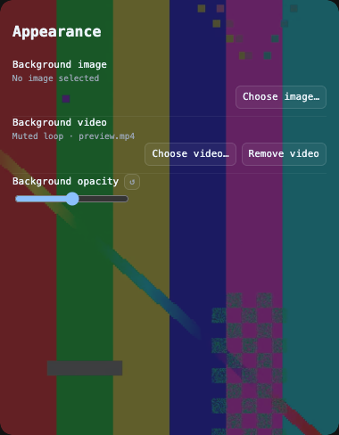

# Background video

In **Settings → Appearance**, choose a local MP4 or WebM file (up to 256 MB) to use as the widget background. H.264 MP4 is a suitable starting point; actual codec support depends on Electron and the platform. The video loops silently and uses the existing background opacity slider. Choosing an image switches back to a static background; removing the video restores the previously saved image, if any.

Playback pauses while the window is hidden, collapsed to a floating bubble, or configured to reduce motion. With reduced motion enabled, the decoded frame remains visible. Reduced transparency and opaque native window materials hide the video.

## Storage and import

Videos stay on this device. After a frame successfully decodes, the main process copies the selection into the application's user-data directory and atomically replaces `background-video.json`. The copy reads from one opened file handle, enforces the byte limit while streaming, and validates the saved file before publishing the manifest. Canceling the picker or rejecting an unsupported, empty or oversized video leaves the previous background intact. The original file can then be moved or deleted. The saved copy and its manifest are removed when the video is cleared; they are not sent to the Hub or iCloud sync.

The renderer receives an opaque `token-monitor-background:` URL instead of a filesystem path or the video's bytes over IPC. The protocol resolves only the currently selected preview or saved video and forwards byte-range requests to Electron's file loader. Register the scheme before Electron is ready and keep it in the `media-src` CSP directive. No additional network listener is required.

Publication and removal run serially. Clearing removes the saved video before its manifest; if the video cannot be deleted, the error is reported and the saved record remains available for retry, including after restarting the app. Failed imports only clean up files created by that import.

## Preview

Focused appearance-control preview using a generated H.264 test video:

