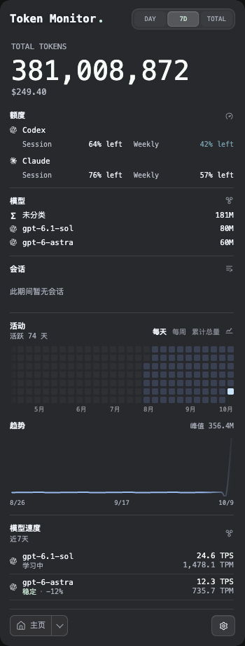
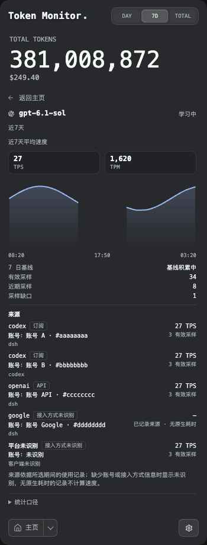

# Long-term model output speed

The Home module **Model speed / 模型速度** follows Sessions by default, including when upgrading an existing saved order. It displays up to five models selected from measured history and current usage, prioritizing confirmed activity and then today’s token usage. Models without matching duration remain visible with an unavailable-speed explanation. Clicking a model opens an integrated Home detail pane. The Home summary, full model list and detail share the selected period: Today, calendar Week, Last 7 days, calendar Month, Last 30 days or Total within the retained 90-day window. Existing Home hiding/reordering and the live footer remain separate.

The detail curve exposes each recorded bucket through pointer hover or Left/Right, Home and End keys. Its tooltip shows the local bucket interval, measured output TPS, equivalent TPM and effective sample count, with a guide and marker at that actual bucket. Missing intervals remain empty; the tooltip never presents a smoothed or interpolated rate as a measurement. It stays within the viewport, hides on departure, Escape, scrolling or resize, and is removed when changing periods or leaving the detail.

History retains a bounded 90-day window. `model-output-speed.json` in Electron's user-data directory stores raw model identifiers, an opaque collector-source hash, anonymous source identities, paired numeric counter anchors, latest source-reference dates and aggregated speed observations. Atomic fsync/rename writes use mode 0600. Last-day observations use five-minute buckets; older data uses hourly weighted aggregates. Buckets intersecting the 90-day window remain available. Corrupt originals are preserved and recording pauses; capacity/persistence failures are visible. Source attribution reads existing local usage evidence; the speed-history file stores no prompts, transcript bodies or credentials, and no new model benchmark calls are made.

## Measurement

Complete local collector updates feed the main process before display aliases or cloud token overlays. Progressive previews, limit-only/presentation updates and duplicate counters cannot generate samples. The collector's `modelThroughput` supplies matching `timedOutputTokens` and `timedDurationMs`; input, cached input and `timedTokens` are excluded from output speed. TPS is paired output tokens × 1000 / reported duration milliseconds. Output TPM is TPS × 60, an output-speed equivalent rather than the footer's all-token burn metric or a provider quota.

Client timing can include request/first-token overhead; it is not an independently measured pure decoding rate. Models without timing, including the current cloud cumulative-counter source, cannot produce speed observations; current-usage candidates remain visible without wall-clock estimates. Display aliases never merge histories. Source hashes separate the local device/client-selection/mode context; raw model IDs are preserved. A model aggregate can contain multiple routes or accounts; the detail shows separate historical platform/account/access identities when evidence supports them. Account attribution does not establish the actual upstream model implementation, prompt length or reasoning effort. The result describes observed client timing and cannot prove a vendor or account throttle.

The first cumulative snapshot is an anchor plus a labeled Today reference, never invented historical samples. New all-time differences must agree with Today differences to reject retrospective imports. Idle polls add no zero-speed observations. Small positive paired differences accumulate until at least 64 output tokens and 1,000 ms are available, allowing genuinely slow streams to remain measurable. Unpaired zero-output/duration changes are not carried into the next speed sample. Lower counters discard unfinished pending samples and retain their high-water anchor; replay cannot create another observation. Day boundaries or gaps longer than 15 minutes re-anchor without inventing timestamps for missed output.

### Mixed timing and binary compatibility

Extraction consumes Tokscale's exact `performance.timedOutputTokens`, including an explicit zero, and adds timed reasoning only for clients with a disjoint reasoning bucket. The same measured numerator feeds sessions, model/source counters, live deltas and new history samples. Source splits are validated against this measured bound, not the row's total output; untimed output still contributes to usage/source references and candidate ordering. This consumer follows #972 and its Antigravity reasoning prerequisite #957 without changing the vendor pin.

Older binaries without the subtotal keep the legacy whole-row approximation. Existing stored samples cannot be repaired from aggregate counters and are not retroactively declared exact. On a downward correction the high-water anchor suppresses replay, discards pending old-basis counters, and may withhold new samples until comparable counters recover. The mixed-timing fix requires the producer and verified binaries; a passing consumer regression does not establish deployed capture correctness or a safe binary release.

## Historical source attribution

The optional per-period `modelUsageSources` catalog carries `{ model, client, platform, accountId, accountLabel, accessType, outputTokens, lastUsedAt? }`, including clients without timing. The separate `modelSourceThroughput` catalog carries the same identity with paired `timedOutputTokens` and `timedDurationMs` from the native row. Catalog keys are canonical JSON arrays `[model, client, platform, accountId, accessType]`; differing accounts, platforms or subscription/API evidence remain separate even for the same model. Each catalog retains at most 128 identities using deterministic canonical-key selection; omitted detail never reduces the original model or period totals. Missing or malformed catalogs mean attribution is unavailable, while a genuine empty object is an exact empty baseline. The wire contract and split validation are documented in [the API reference](API.md).

Native collectors may attach `usageSourceReferences: [{ usageSource, outputTokens, lastUsedAt? }]` to identify historical output without assigning duration. A whole-row `usageSource` or exact timed `usageSources` split can attribute the row's existing native timing only after its evidence and counter bounds hold. Neither path changes output, cost or duration totals. DSH joins a transcript response ID to Magpie's final answering-provider record with matching provider and inclusive output; Codex joins an exact response/thread/turn accounting record or uses that specific token-count event's supported OpenAI plan evidence. The gates and gaps are in the [DSH](providers/dsh.md) and [Codex](providers/codex.md) notes. Current login, quota identity, session creator, model branding and nearby timestamps do not prove a historical account. Magpie request `ms` and `ttft_ms` never enter native throughput.

At the Node collector boundary, native account identity is hashed with SHA-256 using the `usage-account-v1` domain and platform namespace. Shared usage carries only `sha256:` plus 64 lowercase hex digits and the anonymous label `账号 ` plus eight hash digits; arbitrary labels, email addresses and credentials are excluded. If only a historical credential identifier is available, its hash distinguishes credentials without proving that they belong to different billing accounts. Electron persists a further digest of `[model, client, platform, account, accessType]` as the source identity, alongside the anonymous label and an eight-digit account tag; the full shared account hash is not in the source-detail DTO or speed-history extension.

The detail response adds `sources: [{ id, client, platform, accountLabel, accountTag, accessType, weightedTps, samples, timedOutputTokens, timedDurationMs, lastSampleAt, referenceOnly }]`. `accessType` is `subscription`, `api` or `unknown`; missing platform/client/account labels remain empty and render as unknown. A timed source uses sum(native output) × 1000 / sum(native duration milliseconds) within the selected sample window. Its sample count is the number of qualified counter observations. For reference-only entries, `weightedTps` and `lastSampleAt` are null, `samples` and both timed counters are zero, and `referenceOnly` is true; the UI shows unavailable TPS and a source-reference label. Untimed `outputTokens` proves source coverage but is not presented as timed output or used to calculate speed. Source rows appear only in detail; the Home summary and model list retain their existing model-level shape. The response still declares `basis: 'client-reported-output-duration'` and `actualUpstream: 'unknown'`. Model assessment and slowdown classification still use the existing model history.

Reference dates do not become speed sample dates. `modelUsageSources.lastUsedAt` is the latest observed usage time, retained separately from `lastSampleAt`. Today and Month use their corresponding source catalogs only while the saved calendar day/month matches the query; Week, Last 7 days, Last 30 days and Total use the all-time catalog and require its latest usage date to fall within the selected range. A reference without a usage timestamp is eligible only for its current Today or Month scan. Timed anchors can appear as reference-only identities while their observation date is in range, without inventing earlier samples. A latest date cannot reconstruct all request dates or output distribution across a range. In particular, a response whose native period anchor precedes its completion may be present in a calendar catalog yet have its reference excluded by the completion-date filter. Old references outside the retained window are omitted.

Recording source-specific TPS requires stable sole ownership: one identical source identity must cover the model's complete paired native All-time and Today counters in both the previous and current snapshots. Valid source splits or an aggregate delta that matches native totals do not alone prove that historical ownership stayed unchanged. Mixed sources, partial coverage, unavailable catalogs or a changed owner re-anchor source counters and clear pending increments while preserving already qualified source points. Resolving old unknown usage to an account cannot create a new account-speed sample. A later pair of complete snapshots may qualify once the same sole owner and exact counter closure are established. Source references still list every supported platform/account/access identity within the catalog and date limits; model-level TPS continues to use native counters.

Legacy history remains usable. Paired model samples left after subtracting qualified source counters appear as `id: 'unattributed'`, empty identity fields and `accessType: 'unknown'`, with a residual weighted rate, `samples: null`, `lastSampleAt: null` and `referenceOnly: false`. This includes measured native output whose ownership is mixed, partial or changed. No residual speed is created unless both remaining output and duration are positive. Archive-restored totals and payloads that omit source catalogs cannot supply historical account provenance.

## Slowdown heuristic

The baseline is the median of valid observed-window speeds from the preceding seven days, excluding the recent 30 minutes. It requires at least six older windows, 12 qualified observations and 30 seconds of measured duration. The recent comparison requires three consecutive five-minute windows, each with at least two observations and 2,000 ms of measured duration. Only when every recent window is at least 30% slower is **Possible slowdown / 疑似降速** displayed. A transient slow sample, idle period, source/counter change, sparse history or missing timing does not satisfy this rule. Three fresh recovered windows clear the suspicion.

Bucket and range means use sum(output)/sum(duration), not averages of unequal-duration rates. “Samples” means qualified counter observations, not exact request count. Charts retain missing intervals, not zero values. Collection continues with Home hidden or the live footer disabled, while the application process runs. App exit preserves history; exited/offline intervals are not reconstructed. The independent Codex cloud observer and its financial/token aggregation are unchanged.

## Responsive layout and motion

Home modules use their inline-size containers to keep names, primary values, exceptional states and range captions visible. Secondary metadata appears as space permits. Narrow windows stack modules; wide windows use two readable columns and a full-width odd final module. Extra height expands bounded preview rows and plots without increasing text spacing. Activity supports Daily, Weekly and Cumulative projections over retained daily data; these modes do not rewrite counters or reconstruct missing history.

The full model list, Home summary and detail share the top-level period selection. Nested entry/return, hover/fade and curve entry respect reduced motion. Untimed sources remain visible with an unavailable-speed explanation, and missing curve buckets remain gaps. Permanent close choices for cloud accounting/scope notices are persisted only after successful settings writes.

## Verification

Run `npm run verify`, then run `scripts/verify-model-speed-ui.js` and `scripts/verify-model-speed-list.js` with Electron and `TM_SPEED_VERIFY_DIR` set to an absolute private output directory. Both use actual preload/renderer code with synthetic IPC, independent user data and no real-account connection. The UI harness covers responsive geometry, repeated resizing, measured/untimed navigation, shared periods, request generations, retry, keyboard inspection, motion, tooltip positioning and saved dismissal choices. This establishes controlled source behavior; it does not establish installed-app migration, real-account sampling completeness or provider throttling.

History writes request POSIX mode `0600`; that mode assertion applies on POSIX hosts. Windows access control follows the existing user-data directory ACL and is not verified by the POSIX mode bits. Bounded history reads reject named symlinks and mismatched file identities even without `O_NOFOLLOW`; native Windows UI and ACL acceptance still require separate validation.

The current device/client/mode source is persisted as a deterministic PBKDF2-HMAC-SHA256 v2 identifier (600,000 iterations and a dedicated domain salt). One source is cached in memory to avoid repeating derivation on every poll. A v2 observation does not relabel or merge legacy fast-hash source history: the old file rows are retained, and the newly active source re-anchors. Upgrading an installed app while preserving prior-source visibility is not accepted by these source regressions.

